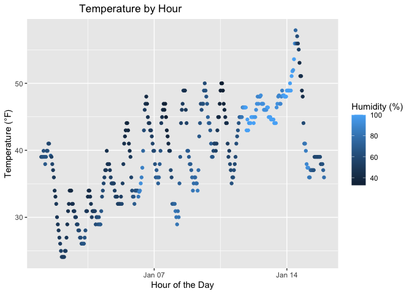

Homework 1
================
Sergio Ozoria Ramírez (smo2147)
2025-09-18

# Initial Setup

Loading the tidyverse package for scatterplot + moderndive package to
access the penguins dataset.

``` r
library(tidyverse)
library(moderndive)
```

# Problem 1

#### Description of Dataset

We will now access the penguins dataset and provide a short description
of the data using inline R code.

``` r
data("early_january_weather")
```

The penguins dataset has **358 rows** and **15 columns**. One important
variable that stands out in this dataset is the **temperature** variable
(i.e., `temp`), along with hour (i.e., `hour`) and the wind speed (i.e.,
`wind_speed`), which are critical in regulating/influencing temperature
levels. It is important to note that the average temperature has a mean
of **39.5821229** in Fahrenheit. Moreover, the average hour is
**11.5307263** and the average wind speed is **8.2258269** in the month
of January, 2023.

The following table describes the remaining variables that were also
used to capture observations in weather patterns in the month of
January, year 2023:

| Variable    | Description                                         |
|-------------|-----------------------------------------------------|
| `origin`    | Location where the weather observation was recorded |
| `year`      | Year of observation                                 |
| `month`     | Month of observation                                |
| `hour`      | Hour of the day                                     |
| `day`       | Day of the month of observation                     |
| `dewp`      | Dew point temperature, indicating moisture in air   |
| `humid`     | Humidity at time of observation                     |
| `wind_dir`  | Wind direction at time of observation               |
| `wind_gust` | Peak instantaneous wind speed at observation        |
| `precip`    | Precipiation at the time of observation             |
| `pressure`  | Atmospheric pressure at time of observation         |
| `visib`     | Visibility at time of observation                   |
| `time_hour` | Time and hour at the time of observation            |

#### Dataframe for Scatterplot

Before we plot what the temperature by the hour looks like in a
scattersplot, let’s use the selection function to create a dataframe for
the variables `time_hour`, `temp`, and `humid`.

``` r
weather_df =
  early_january_weather |>
  select(time_hour, temp, humid
  )
```

#### Plotting Scatterplot

We will now plot the variables `temp` and `time_hour` to see how the
temperature changed by the hour.

``` r
ggplot(
  weather_df, aes
       (x = time_hour, 
        y = temp, 
        color = humid)) + 
  geom_point() + 
  labs(
    x = "Hour of the Day", 
    y = "Temperature (°F)", 
    color = "Humidity (%)") +
  ggtitle("Temperature Patterns by Time and Hour in January, 2023") +
  theme(plot.title 
        = element_text
        (hjust = 0.5)
      )
```

<!-- -->

This scatterplot depicts temperature patterns over time, as well as
changes in humidity levels throughout the month of January in 2023. As
the temperature rises by the hour over the course of the month, humidity
levels also tend to increase. It is important to note that humidity
levels are generally lower in the mornings and higher in the afternoons,
reflecting daily fluctuations in the temperature. This could be caused
by rises in the sun’s temperature and cooling of the Earth’s surface.

# Problem 2

``` r
set.seed(123)

rsamp_df = tibble(
  norm_rsamp = rnorm(10, mean = 0, sd = 1),
  gt_zero = norm_rsamp > 0,
  char_vec = as.character(letters[1:10]),
  factor_vec = factor(
    sample(c("Level 1", "Level 2", "Level 3"), 10, TRUE),
  levels = c("Level 1", "Level 2", "Level 3")
  )
)
```

Let’s now calculate the mean for each variable in `rsamp_df`

``` r
rsamp_df |> 
  pull(norm_rsamp) |> 
  mean()
```

    ## [1] 0.07462564

``` r
rsamp_df |> 
  pull(gt_zero) |> 
  mean()
```

    ## [1] 0.5

``` r
rsamp_df |> 
  pull(char_vec) |> 
  mean()
```

    ## Warning in mean.default(pull(rsamp_df, char_vec)): argument is not numeric or
    ## logical: returning NA

    ## [1] NA

``` r
rsamp_df |> 
  pull(factor_vec) |> 
  mean()
```

    ## Warning in mean.default(pull(rsamp_df, factor_vec)): argument is not numeric or
    ## logical: returning NA

    ## [1] NA
